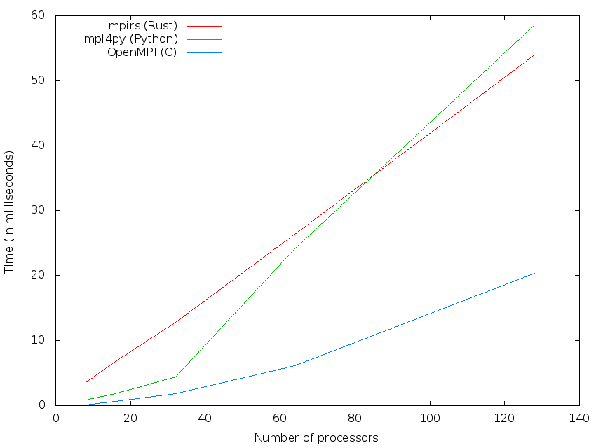
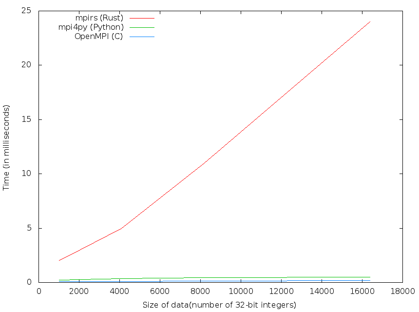
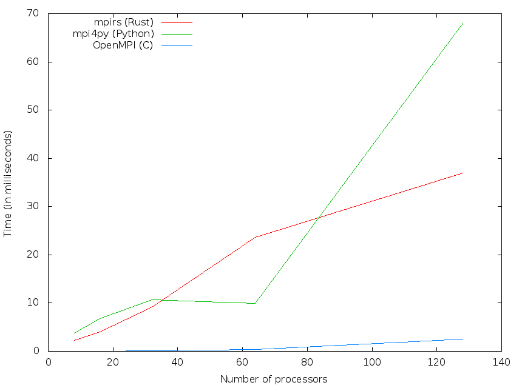

## mpirs-benchmarks

To run C benchmarks, make sure that OpenMPI is installed on the system.
Standard build and execute steps.

Python benchmarks requires OpenMPI and mpi4py to be installed.

Rust benchmarks are automatically built in release (most optimized) mode. Run
`cargo build` inside the `rust/` directory to build all the benchmarks.
Individual benchmarks can then be run (from `rust/` directory) using:

`mpirun-rs -n <num_procs> ./target/debug/<bin_name>`

## Performance - Are we fast yet?

* Results for _token_

* Results for _sendrecv_

* Results for _daxpy_

